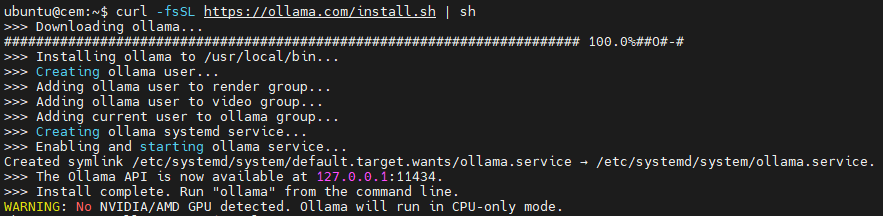
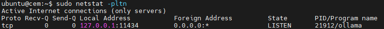
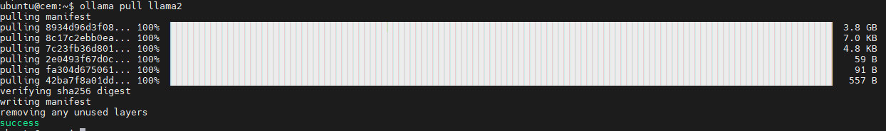
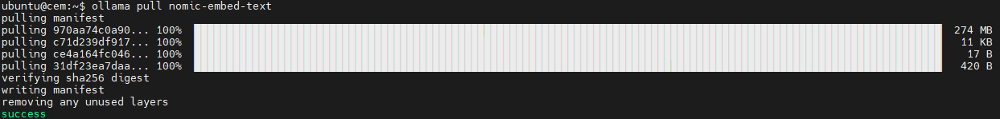
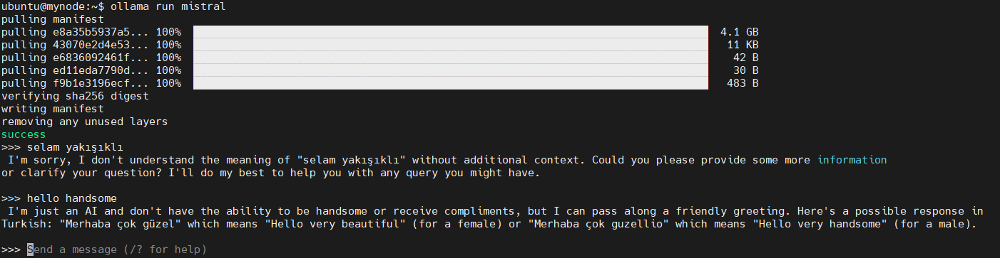
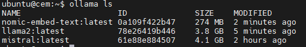
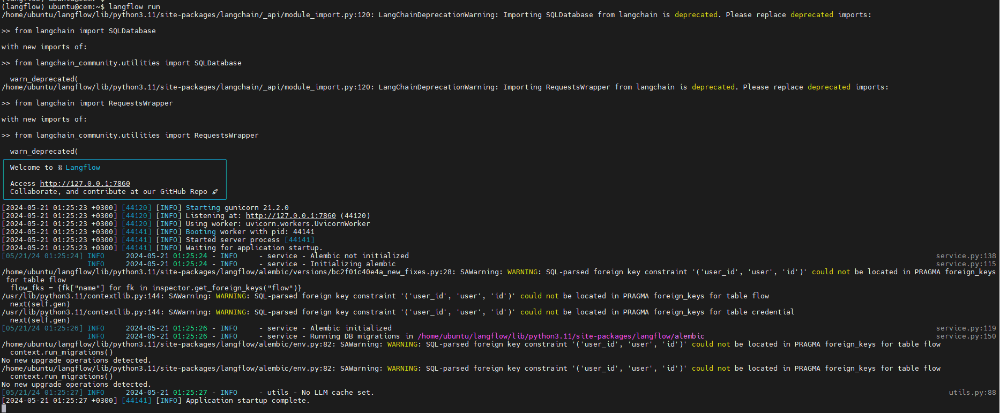
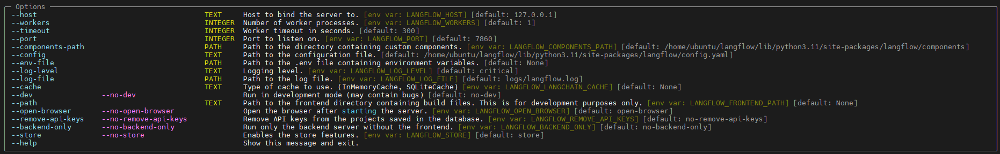

# Retrieval-Augmented Generation (RAG)
Benim anlaıdğım şekliyle RAG belgelendirmesi.

[RAG (Yeniden alarak - Artırılmış Üretim)](https://newsletter.nocode.ai/p/guide-retrieval-augmented-generation), Büyük Dil Modellerine (**L**arge **L**anguage **M**odels) harici kaynaklardan ilgili bilgileri besleyerek yardımcı olur. 
Bu, LLM'lerin yanıtları oluştururken bu bağlamı dikkate almasına olanak tanıyarak yanıtları daha doğru ve güncel hale getirir.


- Belgeyi Yükle: Belgeyi veya veri kaynağını yükleyerek başlayın. 
- Parçalara Böl: Belgeyi yönetilebilir parçalara bölün.
- Gömmeler Oluşturun: Bu parçaları, gömmeleri kullanarak vektör temsillerine dönüştürün.
- Vektör Veritabanında Saklayın: Verimli bir şekilde geri almak için bu vektörleri veritabanına kaydedin.
- Kullanıcı Etkileşimi: Kullanıcıdan sorgular veya girdiler alın ve bunları yerleştirmelere dönüştürün.
- VectorDB'de Anlamsal Arama: Kullanıcının sorgusuna dayalı olarak anlamlı bir arama gerçekleştirmek için vektör veritabanına bağlanın.
- Yanıtların Alınması ve İşlenmesi: İlgili yanıtları alın, bunları bir LLM'den geçirin ve bir yanıt oluşturun.
- Kullanıcıya Yanıtın İletilmesi: LLM tarafından oluşturulan son çıktıyı kullanıcıya geri sunun.

## LangChain
RAG ile yapmak istediğimiz işleri kolaylaştıran hattın adına LangChain diyoruz. LLM'ler etrafında oluşturulmuş açık kaynaklı bir çerçeve olan LangChain, sohbet robotları, özetleme ve çok daha fazlası dahil olmak üzere çeşitli GenAI uygulamalarının tasarımını ve geliştirilmesini kolaylaştırır. Kütüphanenin temel fikri, karmaşık yapay zeka görevlerini basitleştirmek ve Yüksek Lisans (LLM) çevresinde daha gelişmiş kullanım senaryoları oluşturmak için farklı bileşenleri bir araya "zincirlemek"tir.


## LangFlow
LangFlow, LangChain için özel olarak tasarlanmış bir web aracıdır. Kullanıcıların herhangi bir kodlamaya gerek kalmadan LangChain uygulamalarını oluşturmak ve test etmek için bileşenleri basitçe sürükleyip bırakabilecekleri bir kullanıcı arayüzü sunar. Ancak yapay zeka uygulama akışınızı tasarlamak amacıyla LangFlow'u kullanabilmek için öncelikle LangChain'in nasıl çalıştığı ve farklı bileşenleri hakkında temel bir anlayışa sahip olmanız gerekir.

## Ollama
`Ollama` açık kaynaklı LLM'leri kurup çalıştırmanın en iyi ve aynı zamanda en kolay yoludur. Diğerlerinin yanı sıra `Llama 2` ve `Mistral` gibi en yetenekli LLM'leri destekler ve mevcut modellerin listesini [ollama.ai/library](https://ollama.com/library) adresinde bulabilirsiniz.

### Ollama'yı Kurmak 
Öncelikle [Ollama indirme sayfasına](https://ollama.com/download) gidin, işletim sisteminize uygun sürümü seçin, indirip yükleyin. 

Linux makinede:
```sh
curl -fsSL https://ollama.com/install.sh | sh
```



Ollamanın komutları basitçe bize  bize anlatıyor:

```sh
  serve       Start ollama
  create      Create a model from a Modelfile
  show        Show information for a model
  run         Run a model
  pull        Pull a model from a registry
  push        Push a model to a registry
  list        List models
  ps          List running models
  cp          Copy a model
  rm          Remove a model
```

Ollama kuruluyken terminalinizi açın ve aşağıdaki komutları girin. 

```sh
ollama serve
ollama pull llama2
ollama pull nomic-embed-text
ollama run llama2
```

Bu komutlar; 
- modelleri indirecek
- ve makinenizde yerel olarak modelleriniz çalıştıracaktır.

Bu proje için, Büyük Dil Modelimiz (LLM) olarak `Llama2`'yi ve gömme modeli için `nomic-embed-text`'i kullanacağız. 

> `Nomic-embed-text`, geniş bağlam penceresine sahip güçlü bir açık kaynaklı gömme modelidir.

Bu, herhangi bir bulut hizmetine ihtiyaç duymadan uygulamanın tamamını yerel olarak çalıştırmamızı sağlar!

> Ollama hizmetinin 11434 portunda çalıştığını `netstat -pltn` ile göreceksiniz:
> 
> 

> llama2'yi indirdiğimizde 3.8GB büyüklüğünde bir modeli çekmiş olacağız:
> 
> 

> nomic-embed-text gömme modelini indirdiğimizde 

 

#### Mistral'ı Kurmak 

Mistral'ı indirip ollamayı çalıştırarak doğrudan yazışma ekranını açacaktır

```sh
ollama run mistral
```



#### Yüklü Modelleri Listelemek (ollama ls)
`ollama ls` komutuyla yüklü modelleri listeleyebiliriz:



### LangFlow'u Ayarlama 

LangFlow'a başlamadan önce Python'un bilgisayarınızda kurulu olup olmadığını kontrol etmeniz önemlidir. Python sürümünüz 3.9'un üzerinde ancak 3.12'den eski olmalıdır. 
Şimdi LangFlow'u kurmaya geçelim. Bunu sanal ortamda yapmanızı öneririm. Bu yaklaşım, bağımlılıkların kendi alanı içerisinde düzgün bir şekilde yönetilmesine yardımcı olur. Mac bilgisayarımda işleri ayarlamak için Conda'yı kullanıyorum. Python 3.11 ile "langflow" adında bir sanal ortam oluşturmak için aşağıdaki komutları bir komut satırı terminaline girmeniz yeterlidir.

```shell
conda create -n langflow python=3.11
conda activate langflow
pip install langflow
```

Conda'nız yoksa aşağıdaki komutlarla doğrudan Python ile sanal bir ortam da kurabilirsiniz.
```shell
python -m venv langflow
source langflow/bin/activate
pip install langflow
```

Kurulumu tamamladıktan sonra LangFlow'u başlatmak, terminalinize "langflow run" girmek kadar basittir.

### Langflow 
LangFlow'a başlamadan önce Python'un bilgisayarınızda kurulu olup olmadığını kontrol etmeniz önemlidir. Python sürümünüz 3.9'un üzerinde ancak 3.12'den eski olmalıdır.

Python 3.11 ile "langflow" adında bir sanal ortam oluşturmak için aşağıdaki komutları bir komut satırı terminaline girmeniz yeterlidir.
```shell
ubuntu@mynode:~$ sudo add-apt-repository ppa:deadsnakes/ppa
ubuntu@mynode:~$ sudo apt install python3.11
ubuntu@mynode:~$ sudo apt install python3.11-venv
ubuntu@mynode:~$ python3.11 -m venv langflow
ubuntu@mynode:~$ source langflow/bin/activate
(langflow) ubuntu@mynode:~$ pip install langflow
```

Kurulumu tamamladıktan sonra LangFlow'u başlatmak, terminalinize `langflow run` girmek kadar basittir.
Ardından, size verdiği URL'yi alın (yukarıdaki örnekte [http://127.0.0.1:7860](http://127.0.0.1:7860)'tır), web tarayıcınıza yapıştırın ve işte! Buna benzer bir arayüz görmelisiniz. Bu sayfada tüm projeleriniz görüntülenir.



```sh
langflow run --help
```



Dış makinelerden de erişebilmek için `any address` yani 0.0.0.0 dinlesin diye `langflow run --host 0.0.0.0` komutunu çalıştırıyoruz.

Projemiz için PDF dosyasındaki soruları yanıtlayabilen bir sohbet robotu geliştiriyoruz. Daha önce bahsettiğimiz RAG boru hattını hatırlıyor musunuz? Bunu bir araya getirmek için belirli unsurlara ihtiyacımız olacak:

1. **PDF Yükleyici:** Burada "PyPDFLoader"ı kullanacağız. PDF belgenizin dosya yolunu girmeniz gerekecektir. 
1. **Metin Ayırıcı:** "RecursiveCharacterTextSplitter" bizim tercihimiz olacak ve varsayılan ayarlar düzgün çalışacaktır. 
1. **Metin Gömme Modeli:** Ücretsiz, açık kaynaklı yerleştirmeyi kullanmak için "OllamaEmbeddings"i tercih edin. 
1. **Vektör Veritabanı:** Gömmeleri depolamak ve vektör aramalarını kolaylaştırmak için "FAISS" ile gidiyoruz. 
1. **Yanıt Oluşturmak için Yüksek Lisans:** "ChatOllama"yı seçin ve modeli "llama2" olarak belirtin. 
1. **Konuşma Belleği:** Bu, sohbet robotumuzun sohbet geçmişini tutmasına olanak tanıyarak takip eden sorulara yardımcı olur. "ConversationBufferMemory"yi kullanacağız. 
1. **Konuşma Alma Zinciri:** Bu, yanıtlar oluşturmak için LLM, bellek ve alınan metinler gibi çeşitli bileşenleri birbirine bağlar. "ConversationRetrievalChain" bizim seçimimiz.

Tüm bu bileşenleri tuval üzerine sürükleyip bırakın ve PDF dosya yolu ve LLM model adı gibi gerekli alanları ayarlayın. Diğer ayarları varsayılan değerlerinde bırakmanızda bir sakınca yoktur.

Daha sonra akışınızı oluşturmak için bu bileşenleri bağlayın.

Her şey bağlandıktan sonra akışı derlemek için sağ alttaki "yıldırım" düğmesine basın. Her şey yolunda giderse düğmenin yeşile dönmesi gerekir, bu da başarıyı gösterir.

Akışı başarıyla derledikten sonra, yaratımınızı test etmek için "sohbet robotu" simgesine tıklayın.

#### Birkaç ipucu
Akışınız tamamlandığında onu bir JSON dosyası olarak kaydedebilir veya ileride erişim veya düzenleme yapmak üzere "Koleksiyonum" altında bulabilirsiniz. Önceden oluşturulmuş örneklerle LangFlow'a dalmak harika bir ilham kaynağı olabilir ve başlamanıza yardımcı olabilir. Bunu şu şekilde yapabilirsiniz: - "LangFlow Mağazası" örnekleri barındırır, ancak erişim için bir API anahtarına ihtiyacınız olacaktır. - LangFlow GitHub sayfası, daha sonra "yükle" düğmesini kullanarak LangFlow kullanıcı arayüzünüze yükleyebileceğiniz örnekleri indirmenize olanak tanır. Yerel olarak kurulum size göre değilse RAG işlem hattınızı oluşturmak için OpenAI'yi de tercih edebilirsiniz. Kurulum için OpenAI API anahtarınızın yanınızda olduğundan emin olun.

### Akışı Kolaylaştırılmış Bir Chatbot'a Dönüştürme

Artık akış doğru şekilde ayarlandıysa, onu uygulamanıza entegre etmenin zamanı geldi. LangFlow, akışınızı oluşturduktan sonra gerekli kod pasajını sunarak işinizi kolaylaştırır. Kenar Çubuğunda bulunan "Kod" düğmesine basmanız yeterlidir.

Kaynak:
https://freedium.cfd/https://towardsdatascience.com/building-local-rag-chatbots-without-coding-using-langflow-and-ollama-60760e8ed086